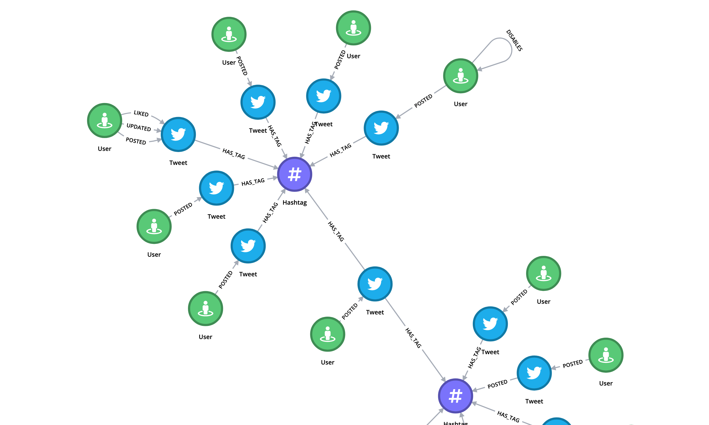

# force-graph

Force directed graph visualization using [D3.js](https://github.com/d3/d3).

-

### ToDo

* zoom fit graph 
* add icons and images to nodes
* add zoom button 
* show node and relationship properties
* add contexmenu 
* pin Nodes
* show every path, or only the shortest path between two nodes
* choose which property for color, label & icon
* add options for fontsize, color, padding etc.

`Refactor`

* set up Webpack Dev Server
* split everything in modules
* use React
* use Typescript
* implement unit-tests

### Fix

* bend multiple relationships for the same target
* bend relationship if source & target is the same
